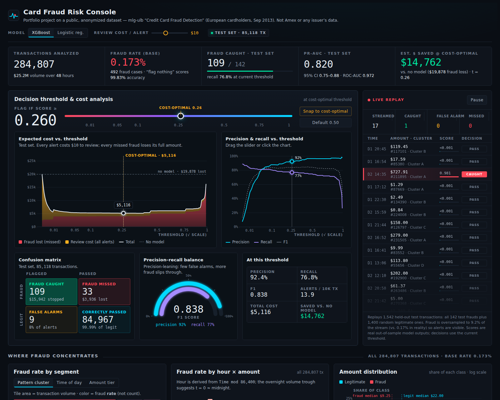

# Card Fraud Risk Console

An interactive fraud-detection dashboard that treats the alert threshold as a **business decision, not an accuracy score**. I trained a model on 284,807 real (anonymized) card transactions. The dashboard shows what each threshold costs in missed fraud and review work, and picks the one that loses the least money.

**[Live demo](https://apichavonillyes.github.io/fraud-risk-console/)** · Python · scikit-learn · XGBoost · D3.js



> Personal portfolio project built on a public dataset. It uses no data from Amex or any other card issuer.

---

## The problem

Only **0.17%** of transactions in this dataset are fraud. A model that flags nothing is 99.83% accurate and catches zero fraud. So accuracy is the wrong question. The useful questions are:

- Of the transactions we flag, how many are really fraud? (**precision**)
- Of all the fraud, how much do we catch? (**recall**)
- Which trade-off between the two costs the business the least?

## Results

Scored on a held-out test set of 85,118 transactions (142 frauds) that the model never saw during training.

| Metric | XGBoost | Logistic regression (baseline) |
|---|---|---|
| **PR-AUC** (95% CI) | **0.820** (0.75–0.88) | 0.707 (0.63–0.79) |
| ROC-AUC | 0.972 | 0.965 |

A model that guesses at random would score a PR-AUC of 0.0017, which is just the fraud rate. I lead with PR-AUC because ROC-AUC looks great for almost any model when the data is this imbalanced.

**At the cost-optimal threshold (0.26), XGBoost:**

- catches **109 of 142** frauds (77% recall)
- raises only **9 false alarms** (92% precision)
- cuts estimated losses from **$19,878 to $5,116**, a saving of about **$14,762 (74%)** on the test set
- beats the default 0.50 threshold, which costs $6,007

## What the dashboard does

- **Threshold slider (the main feature).** Drag it and the confusion matrix, precision, recall, F1, and cost curve all update live.
- **Cost model.** Plots total expected cost against the threshold and marks the cheapest point. The review-cost-per-alert setting is adjustable from $1 to $25.
- **Model toggle.** Switches between XGBoost and logistic regression so you can compare them.
- **Fraud rate by segment.** Breaks down time of day, amount tier, and behavioral cluster, and shows *rates*, not raw counts.
- **Hour × amount heatmap.** Shows when fraud concentrates.
- **Amount distribution.** Compares fraud vs. legitimate amounts on a log scale.
- **Model performance.** PR curve, ROC curve, and feature importance.
- **Live transaction replay.** Streams held-out test transactions with their real model scores and highlights flagged ones.

## Key findings

- **Fraud rate peaks at 2 a.m.** at 1.71%, about 10× the normal rate. 11 a.m. has almost as many frauds (53 vs. 57) but a far lower rate, because daytime volume is 5× higher. This is why the dashboard shows rates, not counts.
- **37% of frauds are $1 or less.** This pattern is often linked to "card testing" (fraudsters checking whether a stolen card works). Median fraud is $9.25, vs. $22.00 for legitimate purchases.
- **Both models agree on what matters.** V14, V10, and V12 carry 67% of XGBoost's split gain, and V14 and V10 are also in the logistic model's top 3.

## Method

1. **Data.** This is the [Kaggle Credit Card Fraud Detection dataset](https://www.kaggle.com/datasets/mlg-ulb/creditcardfraud): European cardholders, two days in September 2013. Features V1–V28 are anonymized (PCA), so they have no business meaning.
2. **Cleaning.** I removed 1,081 exact duplicate rows *before* splitting, so the same transaction can't appear in both training and test data.
3. **Split.** 70% train and 30% test, stratified so both sets keep the same fraud rate.
4. **Models.** XGBoost (depth 4, 300 trees) and an L2 logistic regression as a baseline. Neither uses resampling or class weights. The threshold handles the imbalance instead.
5. **Picking the threshold.** The cost-optimal threshold is chosen with 5-fold cross-validation on the *training* data only, then applied unchanged to the test set. Tuning it on the test set would make the results look better than they really are.
6. **Uncertainty.** 95% confidence intervals come from 300 bootstrap resamples of the test set.

### Cost-model assumptions

| Outcome | Assumed cost |
|---|---|
| Missed fraud | Full transaction amount (no chargeback recovery) |
| Any alert (real or false) | $10 review / customer-friction cost (adjustable) |
| Caught fraud | $0 loss |

The model leaves out customer churn from declined cards, label delays, and review-team capacity.

### Engineered segments

Because the features are anonymized, I didn't invent merchant categories or customer types. Instead, the segments are built only from what the data supports:

- **Time of day:** hour derived from the `Time` column. The dataset doesn't document the clock time it starts at, so this is inferred from the overnight dip in volume.
- **Amount tier:** fixed cut-points set near the amount quantiles.
- **Behavioral cluster:** k-means (k = 6) on V1–V28, without using the fraud labels. The clusters are weakly separated (silhouette score 0.08), so I treat them as loose pattern groups.

## Limitations

- Only two days of data, from one issuer, in 2013.
- A random split, not a time-based one, so performance on future data would likely be lower.
- The test set has only 142 frauds, so the confidence intervals are wide.
- The dataset doesn't state its currency (likely euros). Amounts are shown with "$" for readability.

## Run it yourself

```bash
pip install -r requirements.txt
# Download creditcard.csv from Kaggle into data/
python build_data.py data/creditcard.csv data.json   # trains models, about 1 minute
python assemble.py                                   # builds docs/index.html
```

Open `docs/index.html` in a browser. To publish the demo, turn on GitHub Pages from the `/docs` folder.

## Project structure

```
build_data.py    Cleaning, segments, model training, metrics → data.json
assemble.py      Combines template.html + app.js + data.json into one page
template.html    Layout and styling
app.js           D3.js charts, slider, animations, live feed
data.json        Precomputed results (nothing is retrained in the browser)
docs/            Built dashboard (index.html) and screenshot
```

---

**Apicha von Illyes** · Business Analytics, University of Texas at Arlington · [LinkedIn](https://linkedin.com/in/apichaillyes)
